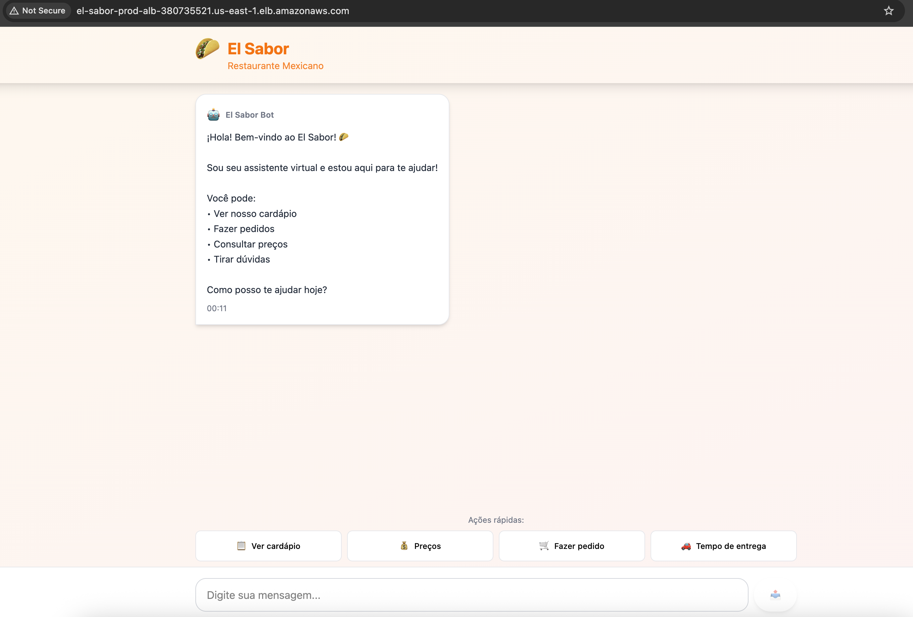
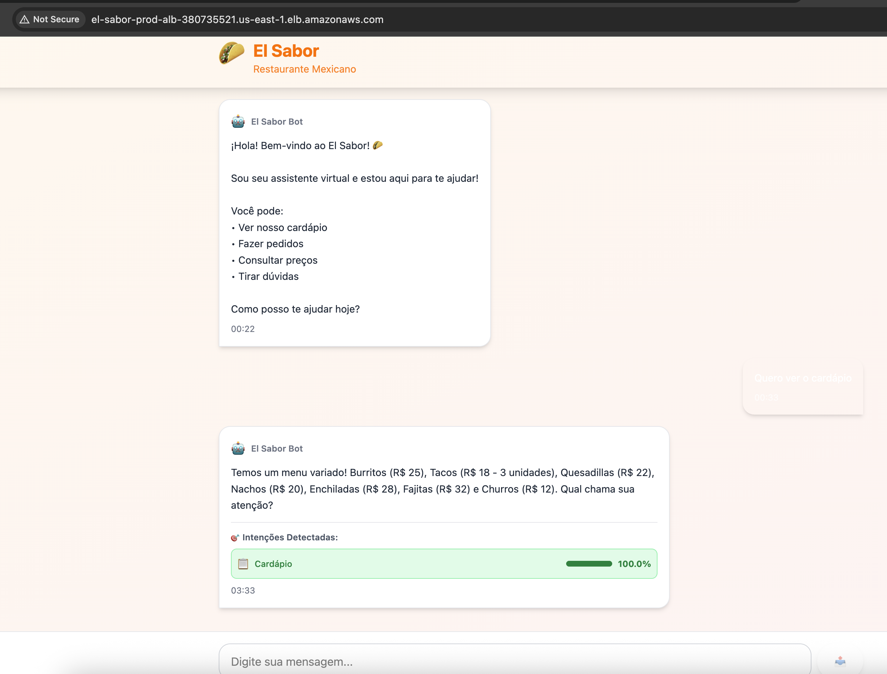

# 🌮 Chatbot IA para Restaurante Mexicano

<div align="center">


**Chatbot inteligente com NLP para automatizar pedidos em restaurante mexicano**

[📚 Documentação](#-documentação) - [🚀 Deploy Rápido](#-deploy-rápido) - [🏗️ Arquitetura](#️-arquitetura) - [📸 Screenshots](#-screenshots)

</div>

---

## 📋 Sobre o Projeto

Sistema completo de chatbot com **Processamento de Linguagem Natural (NLP)** desenvolvido para atender pedidos em um restaurante mexicano moderno chamado **"El Sabor"**.

O projeto demonstra uma arquitetura **cloud-native serverless** completa utilizando AWS ECS Fargate, RDS PostgreSQL, ElastiCache Redis e **Infrastructure as Code (IaC)** com Terraform.

### 🌐 Imagens do El Sabor Chatbot:


### 🤖 Imagens do El Sabor Chatbot apresentando o cardápio:


### ✨ Funcionalidades Principais

- 🤖 **NLP Avançado**: Processamento de linguagem natural com spaCy/NLTK
- 🎯 **Múltiplas Intenções**: Detecta várias intenções em uma única mensagem
- 📊 **Confiabilidade**: Exibe probabilidade de acerto para cada intent detectada
- 🌐 **Interface Web**: Frontend responsivo desenvolvido em Next.js
- 📱 **App Mobile**: Aplicativo nativo com React Native + Expo
- ☁️ **Deploy Automatizado**: Infraestrutura provisionada com Terraform
- 📈 **Observabilidade**: Monitoramento completo com CloudWatch
- 🔄 **Auto Scaling**: Escala automática baseada em CPU/memória
- 🔒 **Segurança**: VPC isolada, encryption at rest, security groups

### 🎯 Intenções Suportadas

O chatbot reconhece as seguintes intenções:

| Intenção | Exemplos | Respostas |
|----------|----------|-----------|
| **Compra** | "Quero um burrito", "Me vê dois tacos" | Confirmação de pedido |
| **Cardápio** | "Quais pratos vocês têm?", "Me mostra o menu" | Lista de itens disponíveis |
| **Preço** | "Quanto custa?", "Qual o valor?" | Informações de preço |
| **Entrega** | "Quanto tempo demora?", "Quando chega?" | Tempo estimado |
| **Agradecimento** | "Obrigado!", "Valeu!" | Mensagem de cortesia |
| **Reclamação** | "Pedido atrasado", "Veio errado" | Tratamento de problema |
| **Cumprimento** | "Oi", "Bom dia" | Saudação |
| **Despedida** | "Tchau", "Até logo" | Finalização |

Cada intenção possui **15+ frases de treinamento** e **4+ respostas variadas**.

---

## 🏗️ Arquitetura

### Stack Tecnológico

#### **Backend**
- **FastAPI**: Framework web assíncrono e performático
- **Python 3.11**: Linguagem principal
- **spaCy / NLTK**: Bibliotecas de NLP
- **scikit-learn**: Machine learning para classificação
- **SQLAlchemy**: ORM para PostgreSQL
- **Redis**: Cache de sessões

#### **Frontend Web**
- **Next.js 14**: Framework React com SSR
- **TypeScript**: Tipagem estática
- **Tailwind CSS**: Estilização
- **Axios**: Requisições HTTP

#### **Frontend Mobile**
- **React Native**: Framework mobile
- **Expo**: Toolchain e APIs nativas
- **React Navigation**: Navegação

#### **Infraestrutura AWS**
- **ECS Fargate**: Containers serverless
- **RDS PostgreSQL 15.4**: Banco de dados relacional
- **ElastiCache Redis 7.0**: Cache em memória
- **Application Load Balancer**: Balanceamento de carga
- **Amazon ECR**: Registro de containers
- **VPC**: Rede privada virtual
- **CloudWatch**: Logs e métricas
- **Terraform 1.5+**: Infrastructure as Code

### Diagrama de Arquitetura
📐 **[Diagrama completo em Draw.io](./docs/architecture-diagram.drawio.xml)**

### Componentes

- **VPC**: 10.0.0.0/16 com subnets públicas e privadas em 2 AZs
- **ALB**: Roteamento inteligente para frontend (/) e backend (/api/*)
- **ECS**: 2 clusters (frontend + backend) com auto-scaling
- **RDS**: PostgreSQL t3.micro com backups automáticos
- **Redis**: ElastiCache t3.micro para sessões
- **ECR**: 2 repositórios para imagens Docker

---

## 🚀 Deploy Rápido

### Pré-requisitos

- [AWS CLI](https://aws.amazon.com/cli/) configurado
- [Terraform](https://www.terraform.io/downloads) >= 1.5
- [Docker](https://www.docker.com/get-started)
- [Make](https://www.gnu.org/software/make/) (opcional)

### Passo 1: Clone o Repositório
```bash
git clone https://github.com/seu-usuario/chatbot-ia-npl-aws-terraform.git
cd chatbot-ia-npl-aws-terraform
```

## 🌐 Aplicação Online

**🔗 URLs de Acesso:**

- **Frontend**: `http://el-sabor-prod-alb-380735521.us-east-1.elb.amazonaws.com/`
- **API Docs**: `http://el-sabor-prod-alb-380735521.us-east-1.elb.amazonaws.com/docs`

**📡 Endpoints da API:**
```bash
# Chat
POST http://el-sabor-prod-alb-380735521.us-east-1.elb.amazonaws.com/api/chat

# Listar intenções
GET http://el-sabor-prod-alb-380735521.us-east-1.elb.amazonaws.com/api/intents

# Histórico de conversa
GET http://el-sabor-prod-alb-380735521.us-east-1.elb.amazonaws.com/api/history/{session_id}
```

**Pronto!** 🎉 Sua aplicação está no ar!

* * * * *

📚 Documentação
---------------

### Estrutura do Projeto

```
chatbot-ia-npl-aws-terraform/
│
├── 📁 terraform/                           # INFRAESTRUTURA COMO CÓDIGO
│   │
│   ├── backend.tf                          # Configuração do backend remoto S3 + DynamoDB
│   ├── main.tf                             # Orquestração dos módulos (chama todos os módulos)
│   ├── variables.tf                        # Declaração de todas as variáveis do projeto
│   ├── outputs.tf                          # Outputs importantes (URLs, endpoints)
│   ├── terraform.tfvars.example            # Exemplo de configuração (copiar para .tfvars)
│   ├── terraform.tfvars                    # Valores reais das variáveis (GIT IGNORE!)
│   │
│   └── 📁 modules/                         # MÓDULOS TERRAFORM REUTILIZÁVEIS
│       │
│       ├── 📁 networking/                  # VPC, Subnets, NAT, IGW
│       │   ├── main.tf                     # Recursos de rede (VPC, subnets, route tables)
│       │   ├── variables.tf                # Variáveis do módulo networking
│       │   └── outputs.tf                  # Outputs (VPC ID, subnet IDs)
│       │
│       ├── 📁 ecr/                         # Container Registry
│       │   ├── main.tf                     # Repositórios ECR para backend/frontend
│       │   ├── variables.tf                # Variáveis do ECR
│       │   └── outputs.tf                  # URLs dos repositórios
│       │
│       ├── 📁 rds/                         # Banco de Dados PostgreSQL
│       │   ├── main.tf                     # RDS instance, subnet group, security group
│       │   ├── variables.tf                # Variáveis (instance type, credenciais)
│       │   └── outputs.tf                  # Endpoint do banco
│       │
│       ├── 📁 elasticache/                 # Cache Redis
│       │   ├── main.tf                     # ElastiCache cluster, subnet group
│       │   ├── variables.tf                # Variáveis do Redis
│       │   └── outputs.tf                  # Endpoint do Redis
│       │
│       ├── 📁 alb/                         # Application Load Balancer
│       │   ├── main.tf                     # ALB, target groups, listeners, rules
│       │   ├── variables.tf                # Variáveis do ALB
│       │   └── outputs.tf                  # DNS do ALB, ARNs dos target groups
│       │
│       └── 📁 ecs/                         # ECS Fargate (Módulo Genérico)
│           ├── main.tf                     # Cluster, task definition, service, auto-scaling
│           ├── variables.tf                # Variáveis (CPU, memória, porta, image)
│           └── outputs.tf                  # Cluster name, service name, security group
│
├── 📁 backend/                             # API BACKEND (FASTAPI + PYTHON)
│   │
│   ├── 📁 src/                             # Código-fonte da aplicação
│   │   ├── main.py                         # Entrypoint da API FastAPI
│   │   ├── nlp_processor.py                # Engine de processamento NLP (spaCy/NLTK)
│   │   ├── intent_classifier.py            # Classificador de intenções (ML)
│   │   ├── models.py                       # Modelos SQLAlchemy (ORM)
│   │   ├── database.py                     # Configuração do banco de dados
│   │   ├── schemas.py                      # Schemas Pydantic (validação)
│   │   ├── routes.py                       # Rotas da API (/chat, /health)
│   │   └── config.py                       # Configurações e variáveis de ambiente
│   │
│   ├── 📁 data/                            # Dados de treinamento
│   │   └── intents.json                    # Intenções, patterns e respostas (15+ por intent)
│   │
│   ├── 📁 tests/                           # Testes unitários
│   │   ├── test_nlp.py                     # Testes do NLP
│   │   └── test_api.py                     # Testes da API
│   │
│   ├── requirements.txt                    # Dependências Python (FastAPI, spaCy, etc)
│   ├── Dockerfile                          # Imagem Docker do backend
│   ├── .dockerignore                       # Arquivos ignorados no build
│   └── README.md                           # Documentação do backend
│
├── 📁 frontend-web/                        # FRONTEND WEB (NEXT.JS)
│   │
│   ├── 📁 src/                             # Código-fonte
│   │   ├── 📁 app/                         # App Router do Next.js 14
│   │   │   ├── page.tsx                    # Página principal (/)
│   │   │   ├── layout.tsx                  # Layout global
│   │   │   └── globals.css                 # Estilos globais
│   │   │
│   │   └── 📁 components/                  # Componentes React
│   │       ├── ChatInterface.tsx           # Interface principal do chat
│   │       ├── MessageBubble.tsx           # Bolha de mensagem
│   │       ├── IntentDisplay.tsx           # Mostra intent + probabilidade
│   │       └── Header.tsx                  # Cabeçalho
│   │
│   ├── 📁 public/                          # Arquivos estáticos
│   │   ├── logo.svg                        # Logo do El Sabor
│   │   └── favicon.ico                     # Favicon
│   │
│   ├── package.json                        # Dependências Node.js
│   ├── tsconfig.json                       # Configuração TypeScript
│   ├── next.config.js                      # Configuração do Next.js
│   ├── tailwind.config.js                  # Configuração do Tailwind CSS
│   ├── Dockerfile                          # Imagem Docker do frontend
│   ├── .dockerignore                       # Arquivos ignorados
│   └── README.md                           # Documentação do frontend web
│
├── 📁 frontend-mobile/                     # APP MOBILE (REACT NATIVE)
│   │
│   ├── 📁 src/                             # Código-fonte
│   │   ├── 📁 screens/                     # Telas do app
│   │   │   ├── ChatScreen.tsx              # Tela principal do chat
│   │   │   └── HomeScreen.tsx              # Tela inicial
│   │   │
│   │   ├── 📁 components/                  # Componentes
│   │   │   ├── ChatMessage.tsx             # Componente de mensagem
│   │   │   └── InputBar.tsx                # Barra de input
│   │   │
│   │   ├── 📁 services/                    # Serviços
│   │   │   └── api.ts                      # Cliente HTTP (axios)
│   │   │
│   │   └── 📁 navigation/                  # Navegação
│   │       └── AppNavigator.tsx            # Navegação do app
│   │
│   ├── App.tsx                             # Componente raiz
│   ├── app.json                            # Configuração do Expo
│   ├── package.json                        # Dependências
│   ├── tsconfig.json                       # TypeScript config
│   └── README.md                           # Documentação do app mobile
│
├── 📁 scripts/                             # SCRIPTS AUXILIARES
│   ├── deploy.sh                           # Script completo de deploy (build + push + update ECS)
│   ├── destroy.sh                          # Script seguro para destruir infraestrutura
│   └── validate.sh                         # Valida pré-requisitos antes do deploy
│
├── 📁 docs/                                # DOCUMENTAÇÃO ADICIONAL
│   ├── ARCHITECTURE.md                     # Arquitetura detalhada com diagramas
│   ├── architecture-diagram.drawio.xml     # Diagrama editável no Draw.io
│   └── API.md                              # Documentação da API (endpoints)
│
├── 📁 .github/                             # CI/CD (OPCIONAL)
│   └── 📁 workflows/
│       ├── deploy.yml                      # GitHub Actions para deploy automático
│       └── terraform.yml                   # Validação do Terraform no PR
│
├── Makefile                                # Comandos make (init, apply, deploy, logs)
├── .gitignore                              # Arquivos ignorados pelo Git
├── README.md                               # Documentação principal do projeto
├── QUICKSTART.md                           # Guia de início rápido (5 min deploy)
└── LICENSE                                 # Licença do projeto (MIT, GPL, etc)
```

### Documentos Importantes

-   📖 [Guia de Início Rápido](./QUICKSTART.md)
-   🏗️ [Arquitetura Detalhada](./docs/ARCHITECTURE.md)
-   🔧 [Troubleshooting](#-troubleshooting)

* * * * *

🚀 Deploy Completo
------------------

### Pré-requisitos

bash

```
# Instalar ferramentas
aws --version        # AWS CLI
terraform --version  # Terraform >= 1.5
docker --version     # Docker

# Configurar AWS
aws configure
```

### 1️⃣ Provisionar Infraestrutura

bash

```
# Clonar repositório
git clone https://github.com/vynnydev/chatbot-ia-npl-aws-terraform.git
cd chatbot-ia-npl-aws-terraform

# Configurar variáveis
cd infrastructure
cp terraform.tfvars.example terraform.tfvars
nano terraform.tfvars  # Alterar db_password!

# Provisionar AWS
terraform init
terraform plan -out tfplan
terraform apply tfplan
```

⏱️ Aguarde 10-15 minutos para criação completa.

### 2️⃣ Deploy do Backend

bash

```
# Build da imagem (arquitetura correta)
cd backend
docker buildx build --platform linux/amd64 -t el-sabor-backend:latest .

# Login no ECR
aws ecr get-login-password --region us-east-1 |\
  docker login --username AWS --password-stdin\
  $(aws sts get-caller-identity --query Account --output text).dkr.ecr.us-east-1.amazonaws.com

# Tag e push
BACKEND_REPO=$(cd ../infrastructure && terraform output -raw backend_ecr_repository_url)
docker tag el-sabor-backend:latest $BACKEND_REPO:latest
docker push $BACKEND_REPO:latest

# Force deployment
aws ecs update-service\
  --cluster el-sabor-prod-backend-cluster\
  --service el-sabor-prod-backend\
  --force-new-deployment\
  --region us-east-1
```

### 3️⃣ Deploy do Frontend

bash

```
# Build da imagem
cd frontend-web
docker buildx build --platform linux/amd64 -t el-sabor-frontend:latest .

# Tag e push
FRONTEND_REPO=$(cd ../infrastructure && terraform output -raw frontend_ecr_repository_url)
docker tag el-sabor-frontend:latest $FRONTEND_REPO:latest
docker push $FRONTEND_REPO:latest

# Force deployment
aws ecs update-service\
  --cluster el-sabor-prod-frontend-cluster\
  --service el-sabor-prod-frontend\
  --force-new-deployment\
  --region us-east-1
```

### 4️⃣ Verificar Deploy

bash

```
# Pegar URL do ALB
cd infrastructure
terraform output alb_url

# Testar backend
curl http://SEU-ALB-URL/api/chat\
  -X POST -H "Content-Type: application/json"\
  -d '{"message": "Olá"}'

# Acessar frontend no navegador
open http://SEU-ALB-URL
```

* * * * *

🛠️ Comandos Úteis
------------------

### Infraestrutura

bash

```
cd infrastructure

# Ver outputs
terraform output

# Atualizar infraestrutura
terraform apply

# Destruir tudo
terraform destroy
```

### Logs

bash

```
# Backend
aws logs tail /ecs/el-sabor-prod-backend --follow --region us-east-1

# Frontend
aws logs tail /ecs/el-sabor-prod-frontend --follow --region us-east-1
```

### Redeploy Rápido

bash

```
# Apenas backend
cd backend
docker buildx build --platform linux/amd64 -t el-sabor-backend:latest .
# ... (tag, push, update service)

# Ou use o script
chmod +x scripts/deploy.sh
./scripts/deploy.sh
```

* * * * *

🐛 Troubleshooting
------------------

| Problema | Solução |
| --- | --- |
| 503 Service Unavailable | Aguarde 2-3min para health checks passarem |
| Tasks não iniciam | Verifique logs: `aws logs tail /ecs/el-sabor-prod-backend` |
| Imagem não encontrada | Confirme push no ECR: `aws ecr list-images --repository-name el-sabor-prod-backend` |
| Frontend não conecta | Verifique URL da API em `ChatInterface.tsx` |

* * * * *

💰 Custos Estimados
-------------------

### Infraestrutura (mensalmente)

-   **NAT Gateway**: ~$32/mês (2 NAT em 2 AZs)
-   **ALB**: ~$22/mês
-   **ECS Fargate**: ~$40/mês (4 tasks rodando 24/7)
-   **RDS t3.micro**: ~$15/mês
-   **ElastiCache t3.micro**: ~$12/mês
-   **ECR**: ~$1/mês
-   **CloudWatch**: ~$5/mês
-   **Data Transfer**: ~$5-10/mês

**Total estimado**: ~$130-140/mês

### Para Reduzir Custos

1.  Use apenas 1 NAT Gateway (-$16/mês)
2.  Reduza `desired_count` para 1 (-$20/mês)
3.  Pare a infraestrutura quando não estiver usando:


* * * * *

📸 Screenshots
--------------

> [Adicione aqui screenshots da interface web e mobile]

* * * * *

🔒 Segurança
------------

-   ✅ VPC isolada com subnets privadas
-   ✅ Security Groups com princípio de menor privilégio
-   ✅ Encryption at rest (RDS + S3)
-   ✅ HTTPS com certificado ACM (opcional)
-   ✅ IAM Roles com permissões mínimas
-   ✅ Secrets via variáveis de ambiente
-   ✅ VPC Flow Logs habilitados
-   ✅ Scan de vulnerabilidades em imagens Docker

* * * * *

🎯 Roadmap
----------

-   [ ]  Implementar AWS WAF no ALB
-   [ ]  Configurar domínio customizado com Route53
-   [ ]  Adicionar AWS Secrets Manager
-   [ ]  Implementar CI/CD com GitHub Actions
-   [ ]  Adicionar testes automatizados
-   [ ]  Implementar Blue/Green deployments
-   [ ]  Adicionar AWS X-Ray para tracing
-   [ ]  Criar CloudWatch Dashboards customizados

* * * * *

👥 Autor
--------

**Seu Nome**

-   🎓 Trabalho Acadêmico - [Nome da Universidade]
-   💼 LinkedIn: [seu-linkedin]
-   📧 Email: [seu-email]
-   🌐 Portfolio: [seu-portfolio]

* * * * *

🙏 Agradecimentos
-----------------

-   [Anthropic Claude](https://www.anthropic.com) - Assistência no desenvolvimento
-   [AWS Documentation](https://docs.aws.amazon.com)
-   [Terraform Registry](https://registry.terraform.io)
-   [FastAPI](https://fastapi.tiangolo.com)
-   [Next.js](https://nextjs.org)

* * * * *

📄 Licença
----------

Este projeto foi desenvolvido para fins **educacionais** como parte de um trabalho acadêmico.